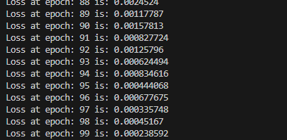

# Neural Network in C++

A simple neural network implementation in C++. This project is a learning exercise to improve C++ skills and understand neural network basics.

## Features

- `Tensor` class for matrix operations
- `torch.nn` like modules like `Linear`, `ReLU`
- Forward and backward pass using optimizer

## Usage

1. Clone the repository:
   ```
   git clone github.com/gladuz/nn-cpp.git
   ```

2. Compile:
   ```
   g++ -std=c++17 *.cpp -o neural_net
   ```

3. Run:
   ```
   ./neural_net
   ```

## Verification with toy example
```c++
Tensor data({1, 2, 3, 4, 5, 6}, 2, 3);  // 2x3 matrix
Tensor target({2, -2}, 2, 1);

nn::Sequential seq;
seq.add(std::make_shared<nn::Linear>(3, 5));
seq.add(std::make_shared<nn::ReLU>());
seq.add(std::make_shared<nn::Linear>(5, 7));
seq.add(std::make_shared<nn::ReLU>());
seq.add(std::make_shared<nn::Linear>(7, 1));
auto optimizer = optim::SGD(seq.parameters(), 0.01);

for(int i=0; i<100; i++){
   auto out = seq.forward(data);
   auto [loss, loss_grad] = nn::functional::mse_loss(out, target);
   cout<<"Loss at epoch: "<<i<<" is: "<<loss<<endl;
   seq.backward(loss_grad);
   optimizer.step();
}
```


## Future Plans

- Add dataloader example with MNIST
- Implement additional layer types